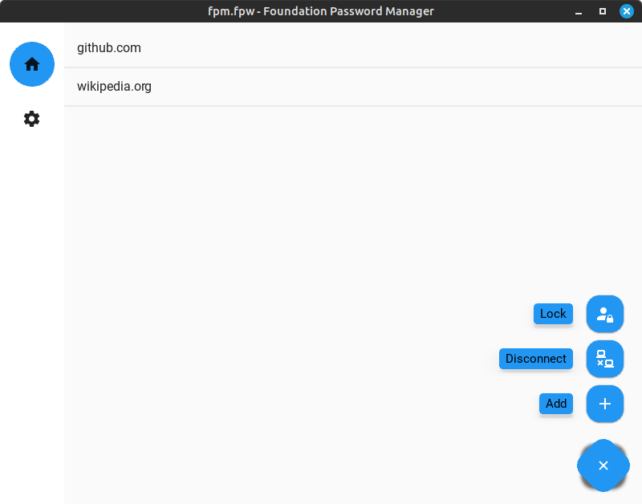
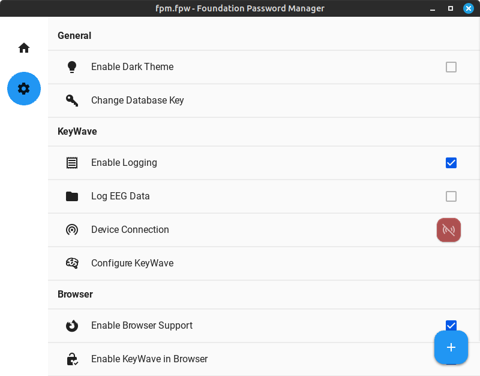

# Foundation Password Manager

[](https://opensource.org/licenses/BSD-3-Clause) []() [](https://www.python.org/dev/peps/pep-0008/) [](https://github.com/GIScience/badges#experimental)

A fully featured password manager serving as a demo application for the capabilities of [NeuroPack](https://github.com/markus-ro/neuropack). The FPM allows for the prototyping of brainwave-based authentication in the browser by adding a visual stimuli based ERP authentication method as extra layer of security for the autofill of credentials. To use this feature, the appropriate settings must be enabled in the FPM and a brain-computer interface, in this case a InteraXon Muse 2, must be connected to the FPM via bluetooth. Further, the companion browser plugin must be installed and activated in the browser. The plugin can be found [here](https://github.com/markus-ro/fpm-browser-plugin).

Besides the brainwave-based authentication, the FPM offers all the features of a modern password manager, such as the creation and management of credentials, sharing of credentials via an encrypted database file, and the generation of secure passwords. It can be fully used without the brainwave-based authentication feature, yet due to its nature as a demo application, it is not recommended to use the FPM as a daily driver password manager.

The FPM uses KivyMD as its GUI framework and is written and tested for Python 3.8 and above. Further, it has been tested on both Windows (10) and Linux (Mint Cinnamon/Mate). On Windows, the GUI takes a long time to load, which is a general problem of Python based GUIs on Windows. On Linux, some features like the file explorer for the database file selection are not working with some exotic window managers.

## Setup
You can use the Foundation Password Manager by cloning this repository:
```bash
git clone https://github.com/markus-ro/fpm
cd fpm
python -m pip install -r requirements.txt
python fpm/main.py
``` 

## Usage
The FPM is divided into three main views allowing for the creation and opening of databases, the management of credentials, and the management of settings. By adhering to Material Design principles, the FPM is easy and straightforward to use.

### Opening and Creating Databases


The Foundation Password Manager uses an propriaetary encrypted database format, which allows for the storage of arbitrary data (in this case brainwave templates) alongside the stored web credentials. The files are denoted with the file extension `.fpw`. Currently there is no way to create a database through the FPM itself. Instead an empty file with the aformentioned extention needs to be created. Once this is done, the file can be openend through the FPM using an arbitrary secret key. The secret key is used to encrypt the database file and is not stored anywhere. If the secret key is lost, the database file cannot be opened anymore. For more information on how the file is created and structured, see the respective [implementation](./fpm/lib/database.py).

### Managing Credentials


### Settings


### Usage with Companion Browser Plugin

# License
The Foundation Password Manager is licensed under the BSD 3-Clause License. See [LICENSE](LICENSE) for more information. The assets folder contains images used for the visual stimuli during brainwave-based authentication. These images are taken from [Pexels.com](https://www.pexels.com/) and are licensed under the [Pexels License](https://www.pexels.com/license/). The images and more information on the license can be found [here](./assets/images/stimuli/info.txt).